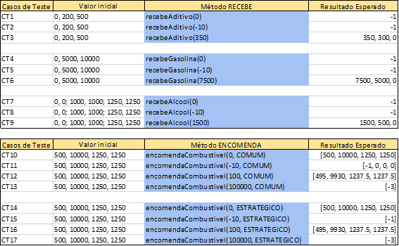
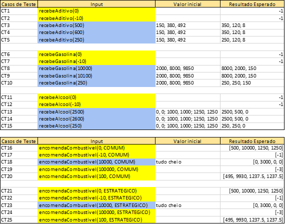
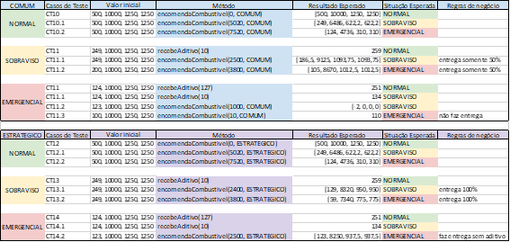
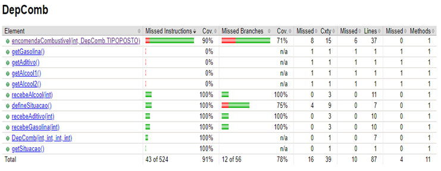
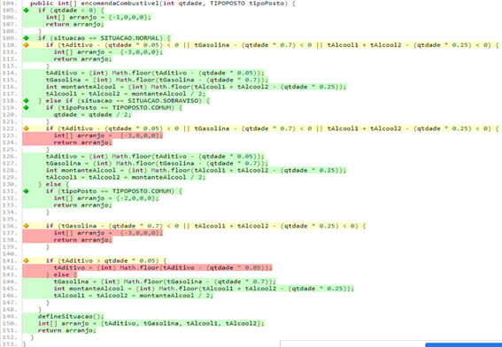

# Verificação e Validação de Software I

## Prof. Bernardo Copstein

### Integrantes: David Bertrand, Guilherme Carvalho, Matheus Tosin e Willian Alves

---

## Relatório dos Casos de Teste

O presente documento tem por objetivo apresentar as Técnicas de Geração de Casos de Teste aplicadas para o desenvolvimento dos testes do trabalho proposto na disciplina de Verificação e Validação de Software I.

## Enunciado do problema

O problema do enunciado consiste identificar os casos de teste possíveis para a distribuição de combustível armazenados em quatro tanques que estão divididos em álcool, gasolina e aditivo. O tanque encontra-se em uma ilha, onde existem dois tipos de postos de combustível, o COMUM e o ESTRATÉGICO.

Dentre a distribuição existem algumas regras que é onde deve ser feito uma análise e previsão de distribuição para que não falte combustível nos tanques. O importante é o posto ESTRATÉGICO tenha prioridade sobre o posto COMUM.

## Estrutura da classe

A estrutura de classe pode ser dividida em três tipos de funções:

- SITUAÇÃO – é responsável para definir a situação dos tanques que por sua vez pode estar em uma das três situações possíveis (NORMAL, SOBRAVISO, EMERGENCIA).
- RECEBE – são funções de carregamento do tanque
- ENCOMENDA – responsável por fazer a entrega dos combustíveis no posto e retornar a situação atual do tanque, onde acima de 50% está em estado NORMAL, abaixo de 50% até 25% encontra-se em estado SOBRAVISO e abaixo de 25% esta em estado de EMERGENCIA.

## Testes

Para realizar os Casos de Testes foi construído três tabelas no Excel com os Teste de Partição, Testes de Valor Limite e Teste Estrutural. Todos os testes foram feitos parametrizados.

## Testes de Partição

> Células azuis = Testes implementados

## Testes de Valor Limite

> Células azuis = Testes implementados

> Células amarelas = Testes repetidos

## Testes Estruturais

> Todos testes foram implementados

## Defeitos encontrados

- Lógicas com `<` e `<=` na verificação dos valores de entrada do construtor e dos combustíveis;
- Arredondamentos dos dois tanques de álcool;
- Caso de entrega 100% para postos estratégicos mesmo em situação de sobreaviso e emergencial.

## Cobertura de código

A imagem abaixo mostra o coverage final após a implementação de todos os testes unitários.

## Casos de testes adicionais para cobertura de blocos de decisão

Primeira vez que a função `encomendaCombustivel()` foi executada obtivemos uma cobertura de aproximadamente 50%. Após alterações na função alcançamos uma cobertura de 90%.

Alguns ramos não possuíram todas as condições corretas, como se pode perceber na imagem. Com isso, alguns pedaços do código também não foram executados.

## Análise das técnicas e ferramentas utilizadas

A técnica utilizada para a criação dos testes foi de testes parametrizados para evitar duplicação de código, onde só eram alterados os parâmetros da classe, os de entrada e os de saída. Desta forma conseguimos abranger a maior parte dos casos de teste.

Referente as ferramentas, foi utilizado um *plugin* junto com o `Maven`, o `jacoco`, no qual permite acompanhar e gerar relatórios de cobertura de código da nossa classe alvo.

## Análise do código da Classe Alvo do Grupo do Gabriel Rabelo

Existem duas interpretações que difere do nosso código da Classe Alvo.

- No código apresentado o métodos que recebe combustível o zero foi considerado uma entrada válida. Após alterar < 0 para <= 0 o testes começaram a ser aprovados.

- Método de encomendaCombustivel() o array de retorno do erro só tem uma posição, diferente do nosso, que espera quatro valores, tanto para uma encomenda válida, quanto para um encomenda inválida. A solução foi adicionar mais três posições do array contendo valor zero em cada uma.
